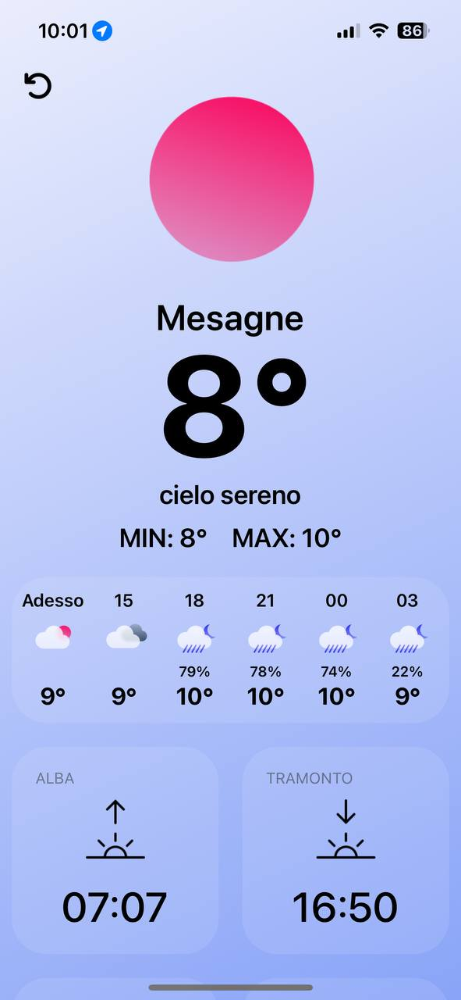
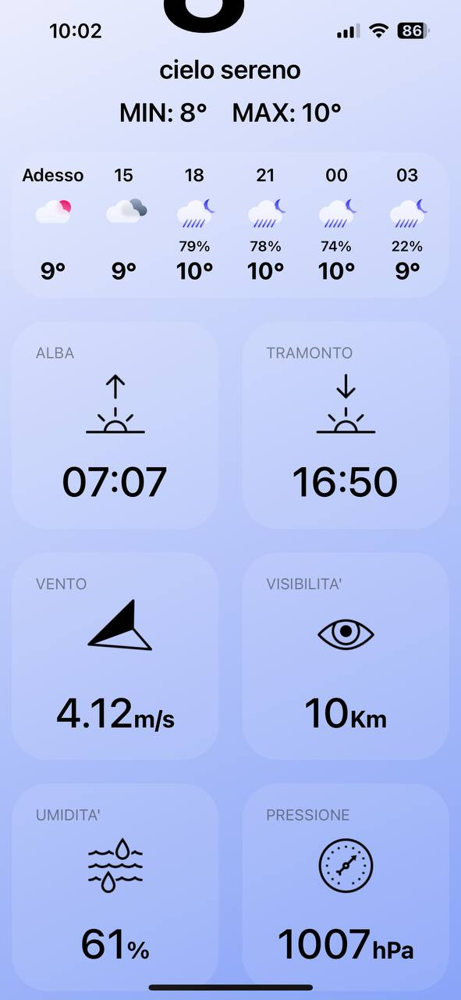

# REACT NATIVE WEATHER APP

- Applicazione realizzata in react native expo, attraverso l'utilizzo dell'API openWeather. L'applicazione all'avvio cerca di prendere la posizione del dispositivo attraverso l'utilizzo della libreria "expo-location", che in primis chiede l'autorizzazione all'accesso della posizione corrente, in seguito controlla se essa è attiva e dopodichè prende i dati della localizzazione del dispositivo. Oltre ad essa ho utilizzato una libreria per poter accedere ai dati inerenti alla connessione del dispositivo, ovvero la libreria "@react-native-community/netinfo", per poter controllare se il dispositivo ha l'accesso ad internet.

# SCREENSHOT

- Loading Page:
    

        
    

- HomePage:
    

        
        
    

